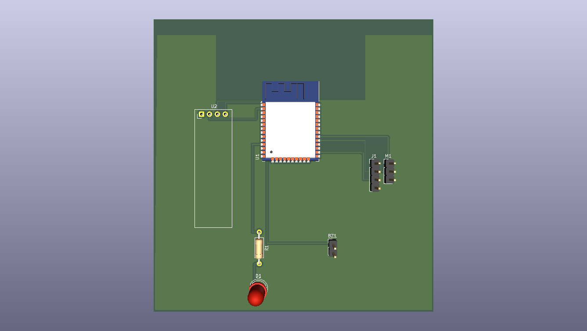

# ESP32 Smart Target Detection System

A compact ESP32-based target detection and alarm system using an HC-SR04 ultrasonic sensor, an SG90 servo, an SSD1306 OLED display, a buzzer, and a red LED.

The system continuously scans its surroundings by rotating the ultrasonic sensor with a servo. When an object enters the configured detection range, the system confirms the detection, locks the servo at the detected angle, activates visual and audible alarms, and displays the target distance and angle on the OLED. When the target disappears, the alarm is cleared and scanning resumes from the position where the target was lost.


## Features

* Servo-based horizontal scanning from 30° to 150°
* HC-SR04 ultrasonic distance measurement
* Three consecutive detections required for target confirmation
* Target lock at the detected servo angle
* Real-time distance and angle display on a 0.96" SSD1306 OLED
* Red LED visual alarm
* Passive buzzer audible alarm
* Three consecutive lost readings required before unlocking
* Automatic scan recovery after target disappearance
* ESP32-based embedded control
* KiCad schematic and PCB design
* ERC-verified schematic
* DRC-verified PCB layout
* Gerber and drill files included

## How It Works

### 1. Scanning

The SG90 servo rotates the HC-SR04 across the configured scan range.

The OLED displays the current:

* Distance
* Servo angle
* System state

Example:

```text
SCANNING

Distance: 82.4 cm
Angle: 72 deg
```

### 2. Target Detection

When the measured distance drops below the detection threshold, the system does not immediately trigger the alarm.

The target must be detected for **three consecutive measurements**.

This reduces false triggering caused by individual noisy readings.

### 3. Target Lock

After three consecutive detections:

* The servo stops at the detected angle.
* The red LED turns on.
* The buzzer activates.
* The OLED switches to `TARGET LOCKED`.
* The measured distance and servo angle are displayed.

Example:

```text
TARGET
LOCKED

DIST: 24.7 cm
ANGLE: 117 deg
```

### 4. Target Lost

While locked, the system continues measuring the target distance.

If the target remains beyond the loss threshold for **three consecutive measurements**:

* The buzzer stops.
* The red LED turns off.
* The lock state is cleared.
* Scanning resumes from the previous servo position.

The system therefore operates continuously:

```text
SCAN
  ↓
TARGET DETECTED
  ↓
TARGET LOCKED
  ↓
ALARM
  ↓
TARGET LOST
  ↓
RESUME SCAN
```

## Hardware

| Component          | Function                           |
| ------------------ | ---------------------------------- |
| ESP32-WROOM-32     | Main microcontroller               |
| HC-SR04            | Ultrasonic distance measurement    |
| SG90 Servo         | Rotates the ultrasonic sensor      |
| 0.96" SSD1306 OLED | Displays state, distance and angle |
| Red LED            | Visual alarm indicator             |
| 1 kΩ Resistor      | LED current limiting               |
| Passive Buzzer     | Audible alarm                      |

## Pinout

| Component    | ESP32 GPIO |
| ------------ | ---------: |
| HC-SR04 TRIG |     GPIO 5 |
| HC-SR04 ECHO |     GPIO 4 |
| SG90 Signal  |    GPIO 18 |
| OLED SDA     |    GPIO 21 |
| OLED SCL     |    GPIO 22 |
| Buzzer       |    GPIO 25 |
| Red LED      |    GPIO 26 |

### Power

* OLED → 3.3 V
* HC-SR04 → 5 V
* SG90 → 5 V
* Buzzer → GPIO 25 / GND
* LED → GPIO 26 → 1 kΩ → LED → GND

> **Hardware note:** The HC-SR04 ECHO output can exceed the ESP32's 3.3 V GPIO logic level. A proper voltage divider or level-shifting stage is recommended for a production-ready version.

## Software

The firmware was developed using the Arduino framework for ESP32.

### Libraries

```text
ESP32Servo
Adafruit GFX Library
Adafruit SSD1306
Wire
```

## Project Structure

```text
ESP32-Smart-Target-Detection-System/
│
├── Firmware/
│   └── Target Lock Radar System.ino
│
├── Hardware/
│   ├── ESP32_Radar_System.kicad_pro
│   ├── ESP32_Radar_System.kicad_sch
│   └── ESP32_Radar_System.kicad_pcb
│
├── Images/
│   ├── schematic.png
│   ├── pcb-layout.png
│   └── pcb-3d.png
│
├── Media/
│   └── media.gif
│
├── gerbers/
│   ├── ESP32_Radar_System-F_Cu.gbr
│   ├── ESP32_Radar_System-B_Cu.gbr
│   ├── ESP32_Radar_System-F_Mask.gbr
│   ├── ESP32_Radar_System-B_Mask.gbr
│   ├── ESP32_Radar_System-F_Paste.gbr
│   ├── ESP32_Radar_System-B_Paste.gbr
│   ├── ESP32_Radar_System-F_Silkscreen.gbr
│   ├── ESP32_Radar_System-B_Silkscreen.gbr
│   ├── ESP32_Radar_System-Edge_Cuts.gbr
│   ├── ESP32_Radar_System-PTH.drl
│   ├── ESP32_Radar_System-NPTH.drl
│   └── ESP32_Radar_System-job.gbrjob
│
├── LICENSE
└── README.md
```

## PCB Design

The PCB was designed in KiCad using a complete schematic-to-PCB workflow:

1. Schematic design
2. ERC verification
3. Footprint assignment
4. Component placement
5. PCB routing
6. GND copper zone
7. DRC verification
8. Gerber generation
9. Drill file generation

### Schematic


### PCB Layout


### 3D PCB View



## Detection Parameters

Current firmware parameters:

```text
Scan range:              30° – 150°
Detection threshold:     35 cm
Target loss threshold:   45 cm
Detection confirmation:  3 consecutive readings
Loss confirmation:       3 consecutive readings
Scan step:               3°
```

These parameters can be modified directly in the Arduino firmware.

## Getting Started

### Hardware

Connect the components according to the KiCad schematic:

```text
Hardware/ESP32_Radar_System.kicad_sch
```

### Firmware

Open the Arduino sketch from:

```text
Firmware/Target Lock Radar System.ino
```

Install the required libraries, select the appropriate ESP32 board, and upload the firmware.

### OLED

The firmware uses an SSD1306 I²C OLED with the default I²C address:

```text
0x3C
```

After startup, the system begins scanning automatically.

## Gerber Files

Production Gerber and drill files generated from the KiCad PCB are available in:

```text
gerbers/
```

The folder contains the required copper, solder-mask, silkscreen, board-outline, and drilling data for PCB fabrication.

## Design Notes

This project uses a **single-axis ultrasonic scanning architecture**.

The HC-SR04 measures distance along the direction in which it is currently pointing. The system performs target detection and angular lock, but it does **not** perform camera-based object classification or continuous visual tracking.

The project was built to demonstrate practical embedded-system concepts including:

* GPIO control
* Ultrasonic distance measurement
* Servo control
* I²C communication
* OLED interfacing
* Event detection
* State-machine logic
* Alarm control
* PCB schematic design
* PCB routing
* ERC and DRC verification
* Gerber generation

## Future Improvements

Possible extensions include:

* Two-axis pan/tilt scanning
* Camera-based object tracking
* PC-based real-time visualization
* Wireless telemetry
* Event logging
* Distance history graphs
* Additional sensing technologies
* Proper HC-SR04 ECHO level shifting
* Improved power distribution

## License

This project is released under the MIT License.

See [`LICENSE`](LICENSE) for the full license text.

## Author

Developed as an ESP32 embedded-systems and PCB-design project.

---

**ESP32 + HC-SR04 + SG90 + SSD1306 + Buzzer + LED**

A compact prototype for ultrasonic target detection, angular locking, visual indication, audible alarm, and automatic scan recovery.
